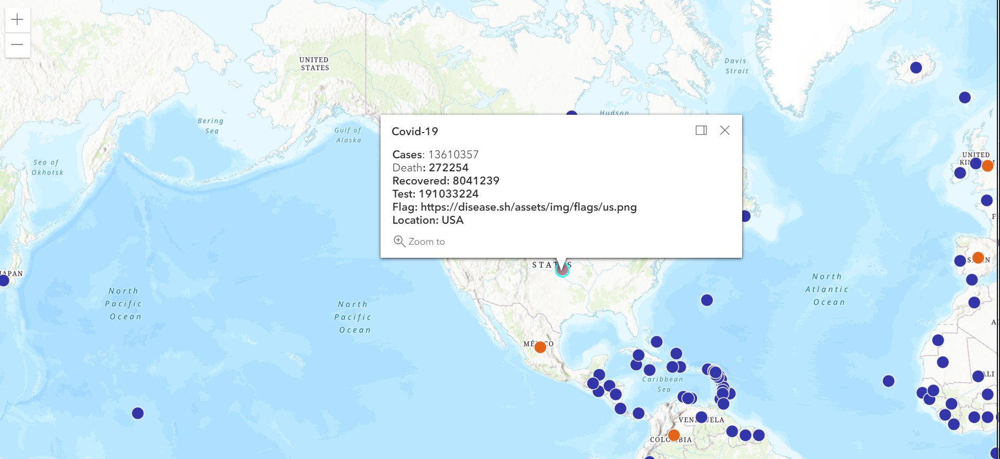

# Overview:
A live updated GIS MAPPING of COVID-19 stats all over the world. It Uses CSS, HTML, and JavaScript with Visual Studio Code and Github.

# Development Enviroment:
* Visual Studio Code
* HTML
* CSS
* JavaScript

# Execution:
* To execute the program: 'Covid-19 GIS MAPPING'
* Go live on your ide

# Sample Output:

# Useful Websites:
* [JavaScriptW3school](https://www.w3schools.com/js/)
* [JavaScriptW3school](https://developers.arcgis.com/labs/browse/?product=javascript&topic=any)